# Spambot Detection — Phát hiện Bot Twitter

Đây là đồ án 2 của mình, xây dựng hệ thống phát hiện tài khoản bot/spam trên Twitter. Mô hình dùng kết hợp GAT + MLP (Graph Attention Network + Multilayer Perceptron) trên dataset Cresci-2017.

> **Đồ Án 2** · Trường Đại Học Sư Phạm Kỹ Thuật Hưng Yên · Khoa Công Nghệ Thông Tin

---

## Mục Lục

- [Giới Thiệu](#giới-thiệu)
- [Kết Quả Mô Hình](#kết-quả-mô-hình)
- [Kiến Trúc Hệ Thống](#kiến-trúc-hệ-thống)
- [Cài Đặt & Khởi Động](#cài-đặt--khởi-động)
- [Hướng Dẫn Sử Dụng](#hướng-dẫn-sử-dụng)
- [API Documentation](#api-documentation)
- [Cơ Sở Dữ Liệu](#cơ-sở-dữ-liệu)
- [Dataset](#dataset)
- [Cấu Trúc Thư Mục](#cấu-trúc-thư-mục)

---

## Giới Thiệu

Bot trên Twitter gây ra khá nhiều vấn đề: lan truyền tin giả, làm nhiễu xu hướng, ảnh hưởng đến kết quả phân tích. Mình xây dựng hệ thống này để tự động phân loại tài khoản là Bot hay Human dựa trên 2 nguồn thông tin:

- **Đặc trưng cá nhân của tài khoản**: tweet rate, tuổi tài khoản, follower ratio, v.v.
- **Cấu trúc đồ thị xã hội**: bot thường follow bot lẫn nhau, tạo thành cụm riêng trong graph

Lý do chọn GAT + MLP là vì GAT xử lý thông tin đồ thị còn MLP xử lý đặc trưng cá nhân — kết hợp lại cho kết quả tốt hơn chỉ dùng GCN đơn thuần.

---

## Kết Quả Mô Hình

| Mô hình | Accuracy | AUC-ROC | F1 Macro | Bot Recall | Params | Epochs |
|---|---|---|---|---|---|---|
| GCN (Baseline) | 95.79% | 0.9909 | 0.9442 | 0.96 | 4,354 | 358 (early stop) |
| **GAT+MLP (đề xuất)** | **98.02%** | **0.9936** | **0.9730** | **0.99** | **9,798** | **700** |

GAT+MLP cải thiện so với GCN: +2.23% Accuracy, +0.0288 F1 Macro, +0.03 Bot Recall.

### Chi tiết trên Test Set

| Class | Precision | Recall | F1 | Support |
|---|---|---|---|---|
| Human | 0.96 | 0.96 | 0.96 | 695 |
| Bot | 0.99 | 0.99 | 0.99 | 2,179 |
| **Macro avg** | **0.97** | **0.97** | **0.97** | **2,874** |

Một số chỉ số thêm:
- Balanced Accuracy: 97.42%
- K tối ưu cho KNN graph: K = 3
- Homophily graph: 0.9434 (93.4% cạnh nối cùng nhãn)

**So sánh với các mô hình trong paper (TwiBot-22, Cresci-2017):**

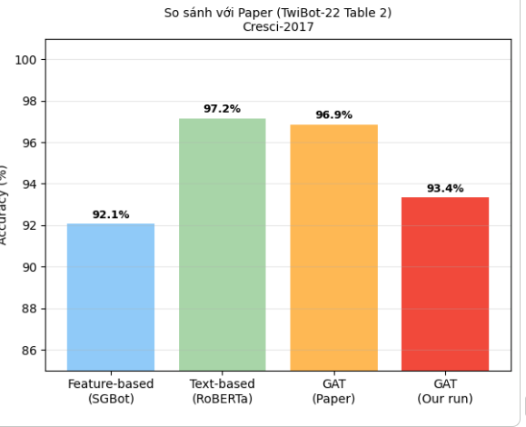

---

## Kiến Trúc Hệ Thống

Hệ thống gồm 4 thành phần chính:

| Thành phần | Công nghệ | Vai trò |
|---|---|---|
| Client | C# / WinForms | Giao diện người dùng |
| Kết nối | Ngrok Tunnel | Cho phép client kết nối đến Colab qua internet |
| AI Server | Google Colab + Flask | Chạy mô hình GAT+MLP, trả kết quả predict |
| Database | SQLite | Lưu lịch sử quét, blacklist, tài khoản người dùng |

### Kiến trúc tổng thể mô hình GAT+MLP

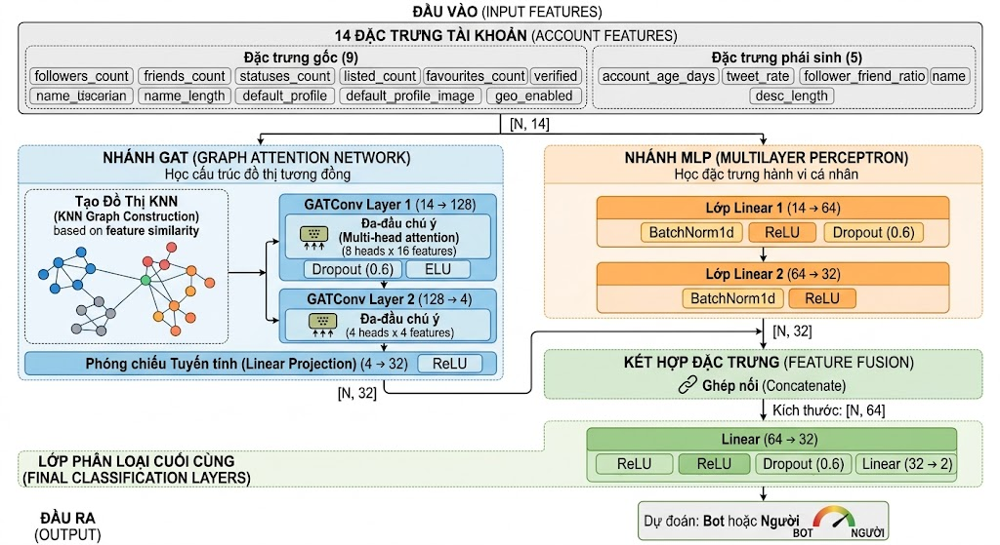

### Kiến trúc chi tiết nhánh GAT

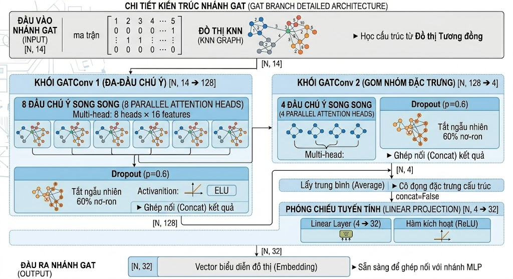

### Kiến trúc chi tiết nhánh MLP

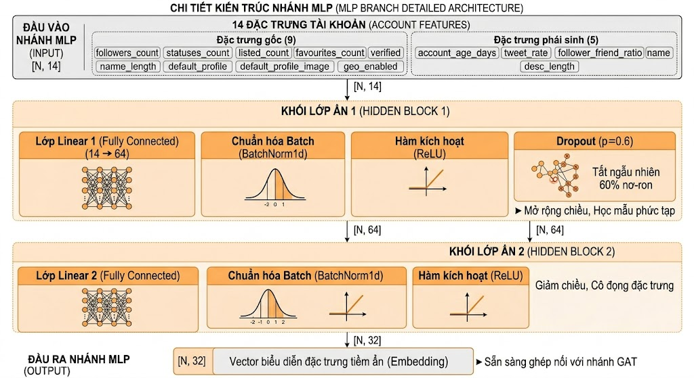

Tổng tham số: 9,798

---

## Cài Đặt & Khởi Động

### Yêu cầu

- Windows 10 / 11 (64-bit)
- RAM tối thiểu 4 GB
- Kết nối internet (bắt buộc, để client nói chuyện với Colab qua Ngrok)
- .NET Framework 4.8 hoặc .NET 6+

---

### Bước 1 — Khởi động AI Server trên Google Colab

> ⚠️ Phải làm bước này trước khi mở ứng dụng Client.

Notebook sử dụng: `cresci2017_gat_mlp_v5.ipynb` — mở trên Google Colab rồi chạy tuần tự từng bước.

---

#### Bước 1.1 — Cài thư viện

```python
!pip install torch_geometric -q
```

Sau đó import các thư viện cần thiết:

```python
import numpy as np, pandas as pd, matplotlib.pyplot as plt
import torch, torch.nn as nn, torch.nn.functional as F
from torch_geometric.data import Data
from torch_geometric.nn   import GATConv
from sklearn.preprocessing import StandardScaler
# ... (xem notebook để đầy đủ)
DEVICE = torch.device('cuda' if torch.cuda.is_available() else 'cpu')
```

Output mong đợi: `Import OK | Device: cuda`

---

#### Bước 1.2 — Tải Dataset Cresci-2017

> Link dataset: [Google Drive — Cresci-2017](https://drive.google.com/drive/folders/1mHUBTJPeG5-faKKblrUQQs1ldJMP8kp8?hl=vi)

Dataset khoảng 466 MB, notebook tự tải về Colab bằng `gdown`:

```python
!pip install gdown
import gdown
gdown.download("https://drive.google.com/uc?id=1Xw_tSlDnrM0i8U7VrVyqTCWLq5uELBd-",
               "/content/cresci-2017.csv.zip", quiet=False)
```

Sau khi giải nén sẽ có đủ các subset: fake_followers, genuine_accounts, social_spambots_1/2/3, traditional_spambots_1, v.v.

---

#### Bước 1.3 — Load & Merge tất cả subsets

Notebook tự đọc từng file `users.csv` trong các subset và gán nhãn tương ứng:

```
genuine_accounts     → 3,474 users | label=0 (Human)
fake_followers       → 3,351 users | label=1 (Bot)
social_spambots_2    → 3,457 users | label=1 (Bot)
social_spambots_1    →   991 users | label=1 (Bot)
...

Tổng: 14,368 users | Bot rate: 75.8%
```

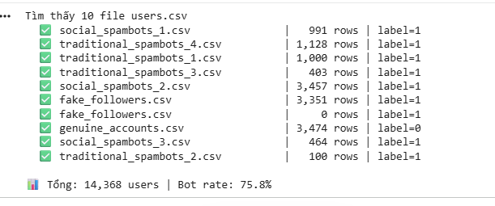

---

#### Bước 1.4 — Feature Engineering

Tính toán 14 features từ dữ liệu thô:

| # | Feature | Mô tả |
|---|---|---|
| 1 | `followers_count` | Số người theo dõi |
| 2 | `friends_count` | Số tài khoản đang follow |
| 3 | `statuses_count` | Tổng số tweet |
| 4 | `listed_count` | Số list chứa tài khoản |
| 5 | `favourites_count` | Số tweet đã like |
| 6 | `verified` | Xác minh chính thức (0/1) |
| 7 | `default_profile` | Profile mặc định (0/1) |
| 8 | `default_profile_image` | Avatar mặc định (0/1) |
| 9 | `geo_enabled` | Bật định vị (0/1) |
| 10 | `account_age_days` | Tuổi tài khoản (ngày, tính đến 2017-10-01) |
| 11 | `tweet_rate` | Tốc độ tweet = statuses / age_days |
| 12 | `follower_friend_ratio` | followers / (friends + 1) |
| 13 | `name_length` | Độ dài tên hiển thị |
| 14 | `desc_length` | Độ dài phần bio |

Toàn bộ features được chuẩn hóa bằng `StandardScaler`.

---

#### Bước 1.5 — EDA

Tính tương quan Point-Biserial giữa từng feature và nhãn:

- `|r| > 0.2`: feature phân biệt tốt
- `|r| > 0.05`: feature yếu
- `|r| ≤ 0.05`: gần như không tương quan

---

#### Bước 1.6 — Train/Val/Test Split

```
Train: 8,620 | Val: 2,874 | Test: 2,874
```

Tỷ lệ 60/20/20, stratified theo nhãn để đảm bảo tỉ lệ Bot/Human đều ở mỗi tập.

---

#### Bước 1.7 — Xây Graph KNN

Vì không có mạng follow thực từ Twitter, mình dùng KNN để tạo graph nhân tạo dựa trên độ tương đồng feature. Bot thường có profile giống nhau nên sẽ tự cluster lại trong graph.

Để chọn K, notebook thử từ K=3 đến K=20 và đánh giá theo:
`Score = Homophily × 0.6 + Density_score × 0.4`

K=3 cho kết quả tốt nhất vì cân bằng được giữa homophily và mật độ graph. K lớn hơn dễ bị over-smoothing.

**Biểu đồ 1 — Tối ưu K:**

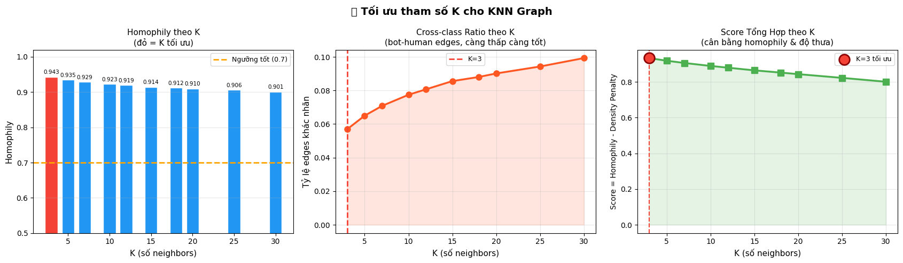

**Biểu đồ 2 — Cấu trúc KNN Graph (80 nodes mẫu):**

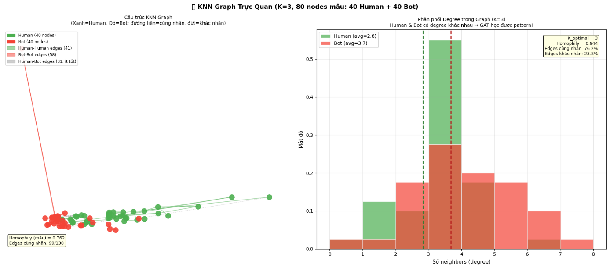

> 40 Human (xanh) và 40 Bot (đỏ). Có thể thấy rõ Bot cluster riêng với nhau, Human cũng vậy — xác nhận homophily cao.

```
Thống kê graph cuối:
Nodes: 14,368
Full edges      : 59,505
Train-only edges: 21,334
Eval edges      : 49,916
Homophily       : 0.9434
```

---

#### Bước 1.8 — Định nghĩa mô hình GAT + MLP

```python
class GATMLPHybrid(nn.Module):
    def __init__(self, in_dim=14, hidden=64, heads=8, n_cls=2, drop=0.6):
        # GAT Branch
        self.gat1     = GATConv(in_dim, 16, heads=8, dropout=0.6)  # → 128
        self.gat2     = GATConv(128, 4, heads=4)                    # → 16
        self.gat_proj = Linear(4, 32)
        # MLP Branch
        self.mlp = Sequential(Linear(14, 64), ReLU(), Dropout, Linear(64, 64), ReLU())
        # Fusion
        self.fusion = Sequential(Linear(96, 32), ReLU(), Linear(32, 2))
```

Tổng tham số: 9,798.

---

#### Bước 1.9 — Tối ưu Hyperparameter (Optuna) + Train

Dùng Optuna (thuật toán TPE) để tìm LR, weight decay, patience tối ưu:

```
Best params: LR=8.98e-03 | Patience=80 | WD=3.96e-05
Val AUC = 0.9960
```

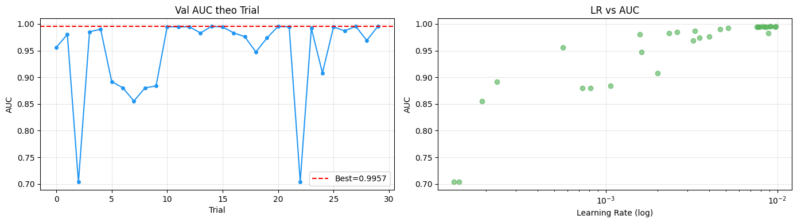

Do mất cân bằng nhãn (75.8% Bot), mình dùng class weights:
```
Human weight = 2.07
Bot weight   = 0.66
```

Training với Epochs=1000, Early Stopping (patience=80), Cosine LR Scheduler.

---

#### Bước 1.10 — Đánh giá & Biểu đồ kết quả

Kết quả cuối trên Test Set:

```
Accuracy          : 98.02%
Balanced Accuracy : 97.42%
AUC-ROC           : 0.9936
F1 macro          : 0.9730
```

**Biểu đồ kết quả (Loss, AUC-ROC, F1, Balanced Accuracy, Recall theo class, Confusion Matrix):**

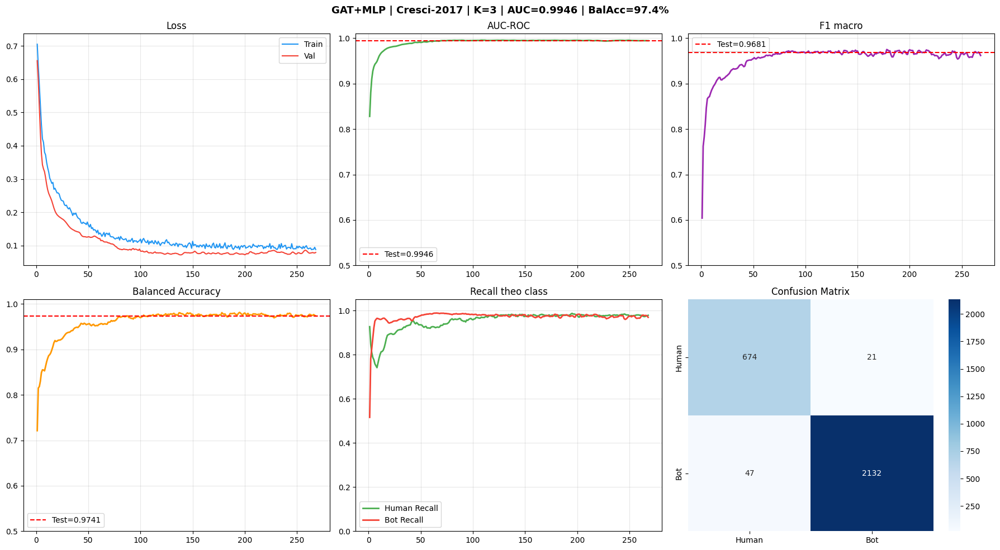

**Loss curve (Train vs Val):**

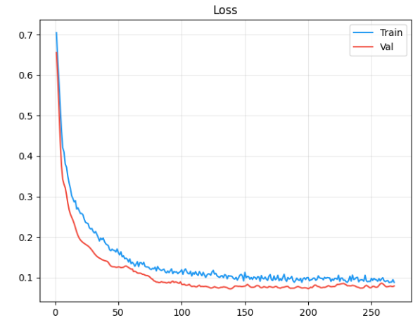

**GCN Baseline — AUC-ROC:**

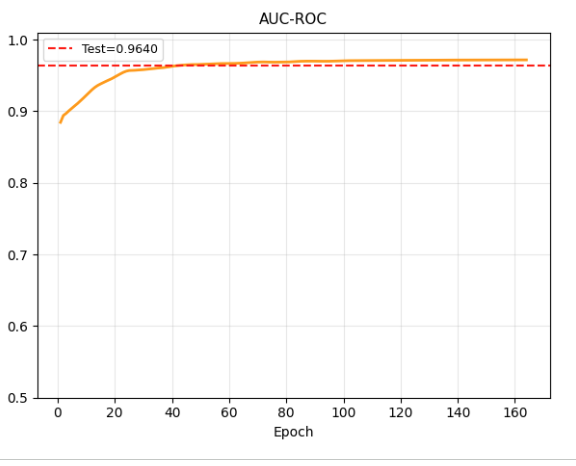

**GCN Baseline — Confusion Matrix:**

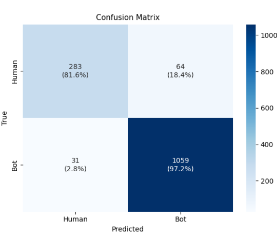

Model lưu tại: `gat_mlp_cresci2017_v5.pt`

---

#### Bước 1.11 — Cài Flask + pyngrok

```python
!pip install flask pyngrok -q
```

---

#### Bước 1.12 — Xác thực Ngrok

1. Vào [https://dashboard.ngrok.com/get-started/your-authtoken](https://dashboard.ngrok.com/get-started/your-authtoken)
2. Đăng ký tài khoản miễn phí nếu chưa có
3. Copy token và dán vào:

```python
NGROK_TOKEN = 'your_token_here'   # thay bằng token của bạn
ngrok.set_auth_token(NGROK_TOKEN)
```

---

#### Bước 1.13 — Hàm Inference

GAT cần `edge_index` để chạy, nên không thể truyền mỗi vector đơn lẻ vào. Giải pháp: giữ toàn bộ `X_scaled` (14,368 nodes) làm reference graph. Mỗi request mới: KNN tìm K=3 neighbor gần nhất → xây mini-graph → chạy model.

```
Reference graph OK | 14,368 nodes | K=3
predict_single() sẵn sàng
Smoke test → label=spam | conf=1.0
```

---

#### Bước 1.14 — Khởi động Flask + Ngrok

Sau khi chạy cell này sẽ in ra URL kiểu:

```
Public URL: https://xxxx-xxxx.ngrok-free.app
Endpoints : /health | /info | /predict | /predict/batch
```

Copy URL đó để điền vào phần cấu hình trong client (UC05).

> Lưu ý: URL Ngrok thay đổi mỗi lần khởi động lại Colab — cần cập nhật lại trong UC05.

---

#### Bước 1.15 — Test API (tùy chọn)

```
TEST 1: GET /health       → 200 OK
TEST 2: POST /predict     → label=spam  | conf=1.0
TEST 3: POST /predict     → label=real  | conf=0.9999
TEST 4: POST /predict/batch (2 accounts) → spam=1, real=1

Tất cả passed — API sẵn sàng!
```

---

### Bước 2 — Cài đặt Client

1. Giải nén `SpambotDetection_Backend.zip` vào thư mục tùy ý
2. Chạy `SpambotDetection.Client.exe`
3. Lần đầu chạy sẽ tự tạo database SQLite
4. Đăng nhập bằng tài khoản mặc định bên dưới

### Tài khoản mặc định

| Vai trò | Tên đăng nhập | Mật khẩu |
|---|---|---|
| Admin | `admin` | `123456` |

> Nên đổi mật khẩu sau lần đăng nhập đầu tiên.

---

## Hướng Dẫn Sử Dụng

### Danh sách chức năng

| Mã UC | Tên chức năng | Phân quyền |
|---|---|---|
| UC01 | Đăng nhập | User / Admin |
| UC02 | Kiểm tra tài khoản đơn lẻ | User / Admin |
| UC03 | Quét hàng loạt từ file CSV | User / Admin |
| UC04 | Quản lý Blacklist | Admin only |
| UC05 | Cấu hình API Endpoint | Admin only |
| UC06 | Xem báo cáo thống kê | Admin only |

### UC01 — Đăng nhập

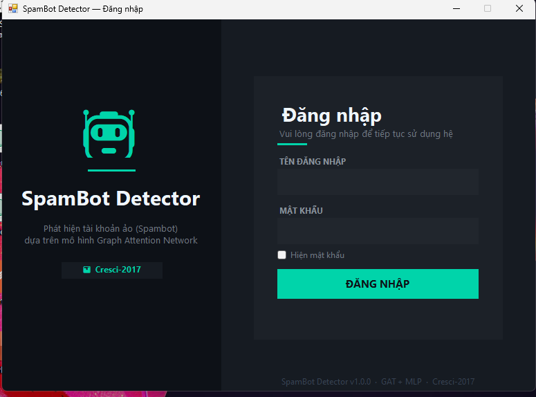

### UC02 — Kiểm tra tài khoản đơn lẻ

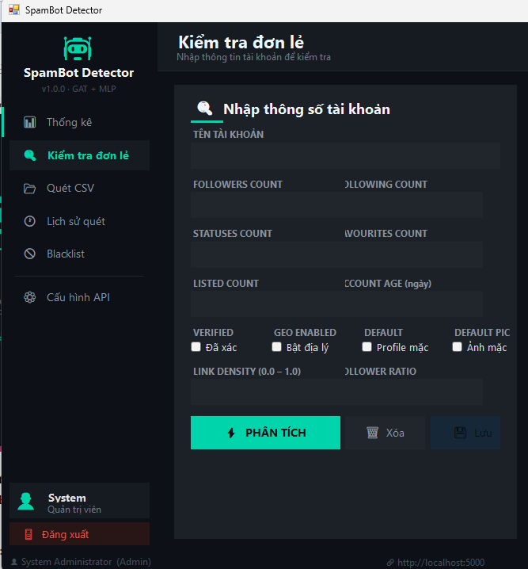

Nhập thông số tài khoản cần kiểm tra:

| Trường | Kiểu | Mô tả |
|---|---|---|
| `accountName` | string | Tên tài khoản |
| `followersCount` | int ≥ 0 | Số người theo dõi |
| `friendsCount` | int ≥ 0 | Số tài khoản đang follow |
| `statusesCount` | int ≥ 0 | Tổng số tweet |
| `listedCount` | int ≥ 0 | Số list chứa tài khoản |
| `favouritesCount` | int ≥ 0 | Số tweet đã like |
| `verified` | 0\|1 | Xác minh chính thức |
| `defaultProfile` | 0\|1 | Profile mặc định |
| `defaultProfileImage` | 0\|1 | Avatar mặc định |
| `geoEnabled` | 0\|1 | Bật định vị |
| `accountAgeDays` | int | Tuổi tài khoản (ngày) |
| `nameLength` | int | Độ dài tên |
| `descLength` | int | Độ dài phần bio |

Kết quả trả về:

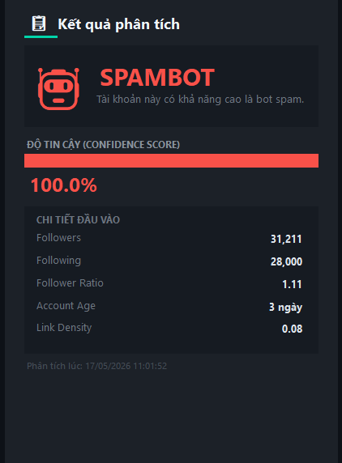

- 🔴 **Spambot** — nhiều khả năng là bot tự động
- 🟢 **Real** — có vẻ là người thật
- Độ tin cậy dưới 60% thì nên kiểm tra thêm bằng tay

### UC03 — Quét hàng loạt từ CSV

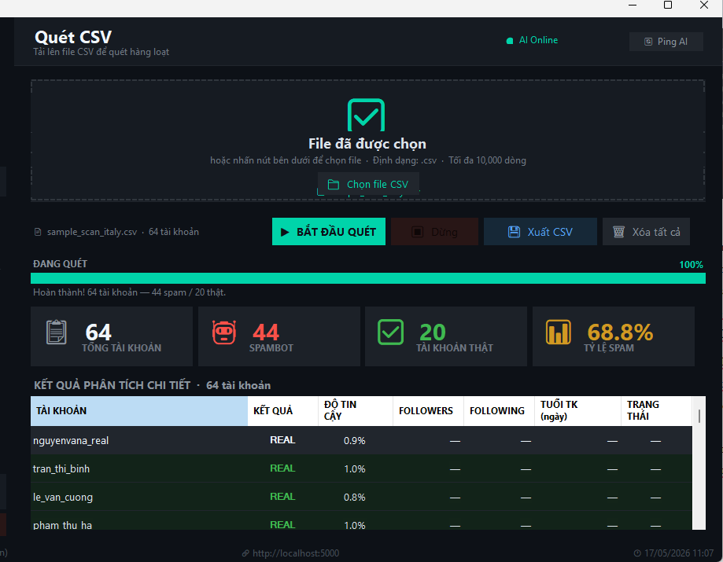

File CSV cần có header đúng cột:

```
accountName, followersCount, friendsCount, statusesCount, listedCount,
favouritesCount, verified, defaultProfile, defaultProfileImage,
geoEnabled, accountAgeDays, nameLength, descLength
```

Sau khi quét xong, nhấn **"Xuất kết quả"** để lưu file CSV có thêm cột `Prediction` và `Confidence`.

### UC04 — Lịch sử quét

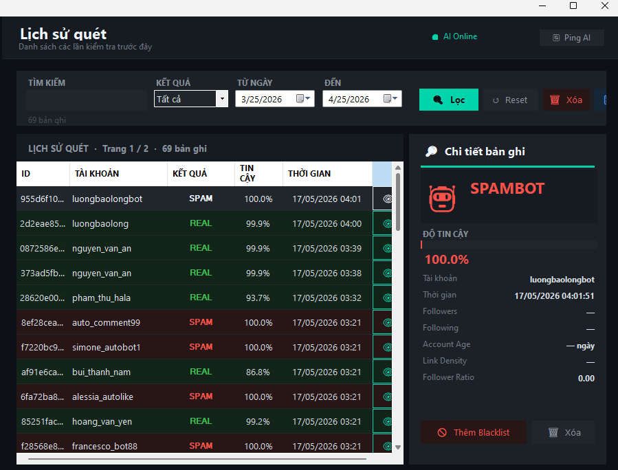

### UC05 — Cấu hình API Endpoint

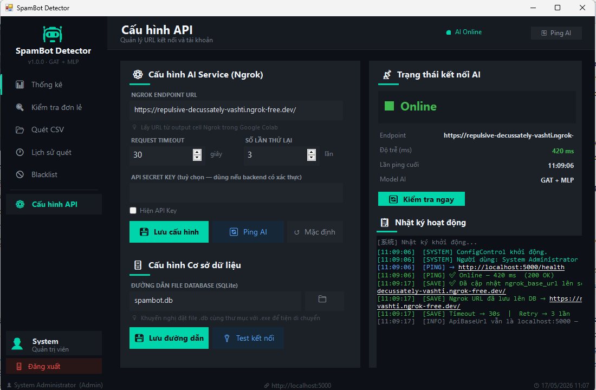

---

## API Documentation

Base URL: `https://<ngrok-url>`  
Authentication: JWT Bearer Token

### Endpoints

#### Auth
| Method | Endpoint | Mô tả |
|---|---|---|
| POST | `/auth/login` | Đăng nhập, trả về JWT |
| POST | `/auth/register` | Đăng ký tài khoản mới |

#### Scan
| Method | Endpoint | Mô tả |
|---|---|---|
| GET | `/health` | Kiểm tra server còn sống |
| GET | `/info` | Thông tin model (metrics, features) |
| POST | `/predict` | Predict 1 tài khoản |
| POST | `/predict/batch` | Predict nhiều tài khoản (tối đa 500) |

### Ví dụ — Predict đơn lẻ

**Request:**
```json
POST /predict
{
  "followers_count": 85000,
  "friends_count": 8,
  "statuses_count": 950000,
  "listed_count": 1,
  "favourites_count": 0,
  "verified": 0,
  "default_profile": 1,
  "default_profile_image": 1,
  "geo_enabled": 0,
  "account_age_days": 30,
  "tweet_rate": 31666.7,
  "follower_friend_ratio": 10625.0,
  "name_length": 12,
  "desc_length": 0
}
```

**Response:**
```json
{
  "label": "spam",
  "confidence": 1.0,
  "prob_spam": 1.0,
  "prob_real": 0.0
}
```

---

## Cơ Sở Dữ Liệu

Dùng SQLite — không cần cài thêm gì, tự tạo khi chạy lần đầu.

| Bảng | Mô tả |
|---|---|
| `Users` | Tài khoản hệ thống (UserID, Username, PasswordHash, Role) |
| `ScanHistory` | Lịch sử quét (ScanID, AccountName, Prediction, Confidence, Timestamp) |
| `Blacklist` | Danh sách bot đã xác nhận (BotID, AccountID, Reason, AddedDate) |

---

## Dataset

**Cresci-2017** — dataset benchmark khá phổ biến cho bài toán bot detection trên Twitter.

> Tải tại đây: [Google Drive — Cresci-2017](https://drive.google.com/drive/folders/1mHUBTJPeG5-faKKblrUQQs1ldJMP8kp8?hl=vi)

| Subset | Loại | Số users | Nhãn |
|---|---|---|---|
| genuine_accounts | Người dùng thật | 3,474 | 0 (Human) |
| social_spambots_1 | Bot bầu cử Ý 2014 | 991 | 1 (Bot) |
| social_spambots_2 | Bot spam ứng dụng di động | 3,457 | 1 (Bot) |
| social_spambots_3 | Bot spam Amazon | 464 | 1 (Bot) |
| traditional_spambots (1–4) | Bot spam URL, việc làm | ~2,631 | 1 (Bot) |
| fake_followers | Bot mua follow | 3,351 | 1 (Bot) |
| **Tổng** | | **14,368** | 75.8% Bot / 24.2% Human |

14 features sử dụng: `followers_count`, `friends_count`, `statuses_count`, `listed_count`, `favourites_count`, `verified`, `default_profile`, `default_profile_image`, `geo_enabled`, `account_age_days`, `tweet_rate`, `follower_friend_ratio`, `name_length`, `desc_length`

Graph: KNN (K=3), Euclidean distance, Homophily = 0.943  
Split: 60% Train / 20% Val / 20% Test (stratified)

---

## Cấu Trúc Thư Mục

```
DoAn1/
├── SpambotDetection_Backend/       # Ứng dụng WinForms C#
├── SpambotDetection_Frontend/      # Frontend
├── img/                            # Hình ảnh README
├── cresci2017_gat_mlp_v5.ipynb    # Notebook train + deploy
├── supabase_schema.sql             # Schema database
├── .gitignore
├── LICENSE
└── README.md
```

---

## Tham Khảo

- Cresci et al. (2017). *Social Fingerprinting: Detection of Spambot Groups Through DNA-Inspired Behavioral Modeling.* IEEE TKDE.
- Veličković et al. (2018). *Graph Attention Networks.* ICLR.
- PyTorch Geometric: https://pyg.org
- Dataset: [Indiana University Bot Repository](https://botometer.osome.iu.edu/bot-repository/)

---

*Đồ Án 2 · Khoa CNTT · ĐHSPKT Hưng Yên · 2025–2026*
